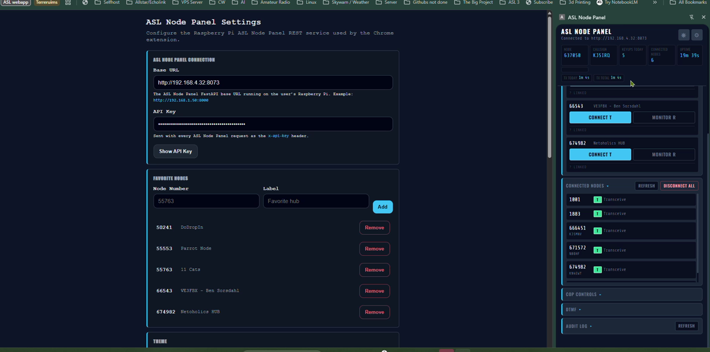
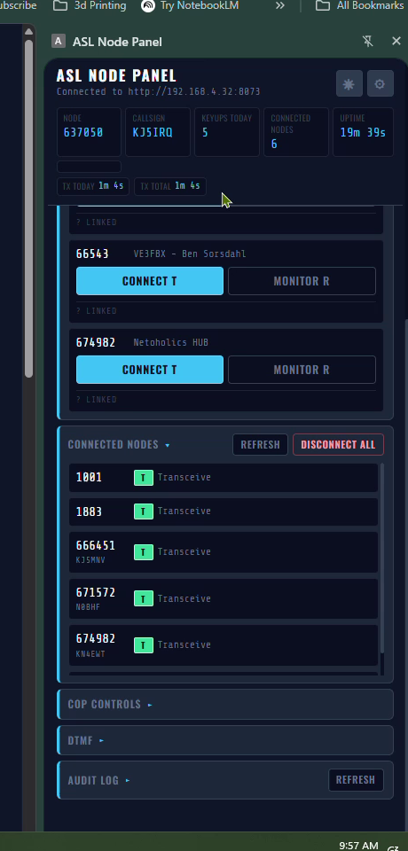
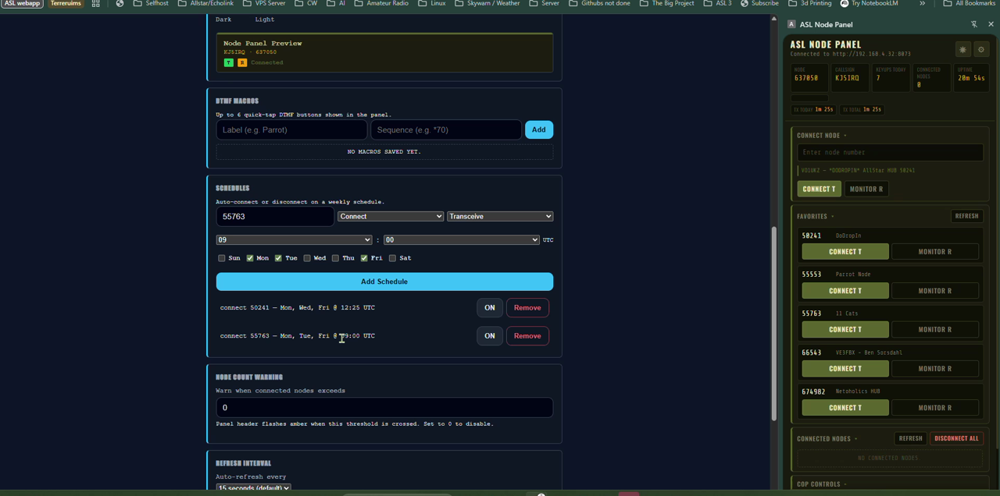
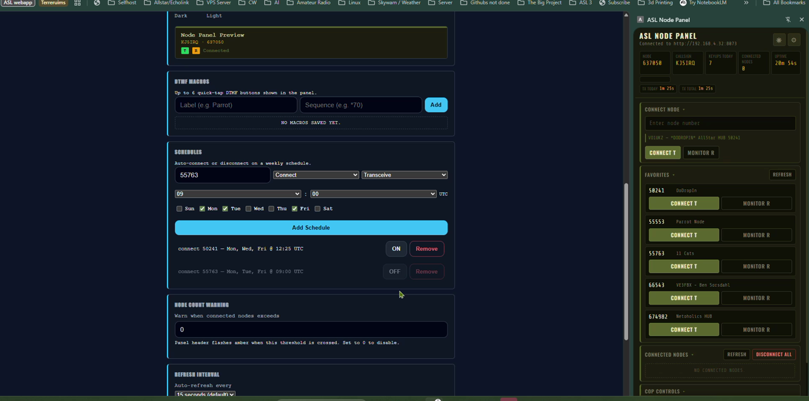

# ASL Node Panel

A Chrome side panel extension for monitoring and controlling your AllStarLink node via [ASL3-API](https://github.com/KJ5IRQ/asl3-api). Connects to a FastAPI-based REST middleware running on your ASL3 Raspberry Pi.

**Current version:** v0.6.2  
**Backend required:** ASL3-API v1.3.0+ running on your Pi

---

## Demo


---

## Screenshots

### Panel + Settings



### Panel — Live Node Data



### Themes



### Schedules & Settings



---

## Features

### Node Status
- Live node number, callsign, keyups today, connected node count, and uptime
- TX time today and TX time total
- Real-time KEYED indicator (pulses amber when `rxkeyed` is true)
- Node count warning threshold — alerts when connected count exceeds a configurable limit

### Connect & Control
- Connect to any node by number in Transceive or Monitor-only mode
- Node lookup: type a node number and see callsign + location before connecting
- Disconnect All with confirmation dialog
- Favorites list with one-tap Connect T / Monitor R buttons
- Favorites show live status (linked count, keyed state) from the ASL stats API
- DTMF macro buttons: configure up to 6 one-tap sequences in settings
- Raw DTMF input field for arbitrary sequences

### COP Controls
- Identify, Time, Status, Version — one-tap buttons that send COP commands to your node

### Schedules
- Auto-connect or auto-disconnect on a weekly schedule (day + UTC time)
- Toggle individual schedules on/off without deleting them
- Next scheduled event shown as a persistent indicator in the panel

### Connected Nodes
- Live list of connected nodes with mode badge (T/R) and callsign when available
- Callsign and location populated from enriched `/nodes?enrich=true` endpoint

### Audit Log
- Last 50 audit entries from the node, auto-refreshed

### Themes
- **System Default** — follows OS `prefers-color-scheme` automatically via CSS `light-dark()`
- **Signal Corps** — olive/khaki WW2 Signal Corps aesthetic
- **Dark Navy** — deep blue, high saturation accents
- **Slate** — neutral dark/light, clean and modern
- **High Contrast** — maximum contrast for low-vision users
- **Desert Sand** — warm tan tones
- **Custom** — 10 key color pickers for full control
- All themes have dark and light variants
- Light/dark toggle button (☀/☾) in the panel header
- Theme applies to both the panel and settings page

### Accessibility
- **Screen Reader Mode** (in Settings > Accessibility)
- When enabled: ARIA live regions announce status changes and errors to NVDA, JAWS, VoiceOver, or ChromeVox
- All summary cards have `aria-labelledby` associations
- `role="main"` landmark, `role="switch"` on the accessibility toggle
- Enhanced focus rings and enlarged touch targets when enabled

---

## Requirements

- Chrome 116+
- [ASL3-API](https://github.com/KJ5IRQ/asl3-api) v1.3.0+ running on your ASL3 Pi
- Your Pi's local IP and the API key from your ASL3-API config

---

## Installation

1. Clone or download this repo
2. Go to `chrome://extensions`
3. Enable **Developer mode**
4. Click **Load unpacked** and select the repo folder
5. Click the extension icon or open the Chrome side panel
6. Click the gear icon (⚙) to open Settings
7. Enter your Pi's base URL (e.g. `http://192.168.4.32:8073`) and API key
8. Click **Save Settings**

---

## File Structure

```
asl-node-panel/
  manifest.json           Extension manifest (v3), v0.6.2
  background.js           Service worker, side panel registration
  sidepanel.html          Panel UI
  sidepanel.js            Panel logic, state, accessibility engine
  sidepanel.css           Panel styles, all themes via CSS variables + light-dark()
  options.html            Settings page UI
  options.js              Settings logic
  options.css             Settings page styles
  assets/                 Screenshots and demo GIF
  services/
    api.js                ASL3-API client (all endpoints)
    storage.js            chrome.storage.sync schema and normalizers
    theme.js              Theme engine
    theme-init.js         Theme initializer for options page (CSP-safe)
```

---

## API Endpoints Used

| Endpoint | Purpose |
|----------|---------|
| `GET /status` | Node status, uptime, tx time, keyups |
| `GET /variables` | rxkeyed, txkeyed, num_links |
| `GET /nodes?enrich=true` | Connected nodes with callsign/location |
| `GET /audit` | Audit log entries |
| `GET /lookup/{node}` | Node lookup by number |
| `GET /version` | API version info |
| `POST /cop/identify` | Play node ID |
| `POST /cop/time` | Say current time |
| `POST /cop/status` | Say system status |
| `POST /cop/version` | Say app_rpt version |
| `POST /connect/{node}` | Connect to a node |
| `POST /disconnect-all` | Disconnect all connected nodes |
| `POST /dtmf` | Send a DTMF sequence |

---

## Version History

| Version | Summary |
|---------|---------|
| v0.1.0 | Initial release |
| v0.2.0 | Bug fixes, /variables polling, keyed indicator, enriched nodes, COP methods, renamed to ASL Node Panel |
| v0.2.1 | Auto-save favorites |
| v0.3.0 | Collapsible sections, DTMF macros, node lookup, refresh interval setting |
| v0.4.0 | Scheduled connect/disconnect, favorites live status, node stats, count warning |
| v0.5.0 | Full theme system: 6 presets, dark/light, custom pickers |
| v0.5.1 | CSS rewrite: `light-dark()` throughout, `data-theme` attributes |
| v0.5.2 | Panel header light/dark toggle button |
| v0.6.0 | Accessibility: Screen Reader Mode, ARIA live regions |
| v0.6.1 | Fix screen reader mode propagation |
| v0.6.2 | Fix inline script CSP violation on options page |

---

## License

MIT
